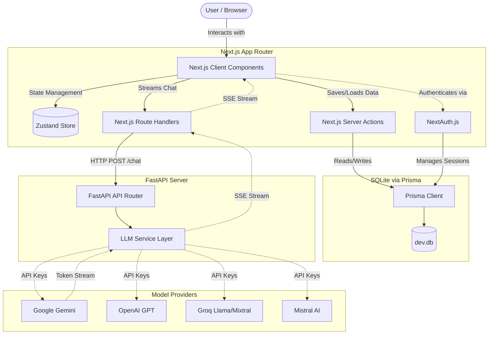

# Phase 1: High Level Architecture

Welcome to Phase 1. As a junior developer joining the AURA-AI project, the first thing you need is a map of the territory. Before we write or critique a single line of code, we must understand the grand design. 

AURA-AI is a full-stack, decoupled AI application. It relies on a **Next.js Frontend** for UI and state, a **FastAPI Backend** for AI routing and streaming, and a **SQLite/Prisma Database** for persistence.

Let's break down how these pieces fit together.

## 1. Complete System Architecture

Here is the 10,000-foot view of how AURA-AI is architected. Take a moment to trace the lines from the user to the LLM providers and back.

### WHAT this architecture is:
This is a **Decoupled Client-Server Architecture** specifically designed for real-time generative AI. It separates the presentation/data-persistence layer (Next.js) from the computationally heavy or specific AI routing logic (FastAPI).

### WHY it exists / WHAT problem it solves:
You could theoretically build everything in Next.js. However, Python (FastAPI) is the lingua franca of AI. By separating the backend, you unlock the massive Python ecosystem (LangChain, LlamaIndex, direct provider SDKs) without fighting Node.js for heavy AI workloads. The frontend remains blazing fast, while the backend acts as a dedicated AI microservice.

---

## 2. Component Architectures Explained

### Frontend Architecture (Next.js App Router)
The frontend uses the modern App Router (`src/app`). 
*   **What it does:** It handles routing, UI rendering, client state (Zustand), and server-side database operations (Server Actions).
*   **Why this implementation:** Next.js provides hybrid rendering. React Server Components (RSC) fetch database data securely without exposing APIs, while Client Components render the interactive chat interface. Zustand was chosen over Redux because it is significantly lighter and requires zero boilerplate for a simple chat app.

### Backend Architecture (FastAPI)
Located in `/backend`, the Python server exposes a REST API.
*   **What it does:** It receives chat requests from the frontend, determines which AI model to use, communicates with external providers, and streams the response back.
*   **Why this implementation:** FastAPI is asynchronous by default. When connecting to slow external LLM APIs, async programming ensures your server doesn't freeze waiting for OpenAI to respond. It uses Pydantic for strict data validation.

### Authentication Architecture (NextAuth.js)
Handled completely within Next.js.
*   **What it does:** Secures the app. It manages OAuth providers (like Google or GitHub), handles JWTs or database sessions, and secures Server Actions so only logged-in users can save conversations.
*   **Why this implementation:** NextAuth is the industry standard for Next.js. It integrates directly into the Prisma database without requiring a separate auth microservice (like Auth0 or Clerk), keeping the architecture self-contained.

### Database Architecture (Prisma + SQLite)
Located in `/prisma/schema.prisma`.
*   **What it does:** Stores Users, Sessions, Conversations, and individual Messages. 
*   **Why this implementation:** SQLite is a local file-based database (`dev.db`), perfect for local development and small apps. Prisma is a strictly-typed ORM (Object-Relational Mapper) that makes querying the database from TypeScript safe and predictable.

### AI Architecture (Provider Routing)
Located in `backend/app/services/llm_service.py`.
*   **What it does:** Acts as an abstraction layer. The frontend just says "I want to talk to model X". The backend figures out if Model X belongs to Gemini, OpenAI, Groq, or Mistral, instantiates the correct client, and executes the request.
*   **Why this implementation:** Vendor lock-in is dangerous in AI. By building a central `LLMService`, if OpenAI goes down or raises prices, you simply route traffic to Mistral or Gemini without touching a single line of frontend code.

### Streaming Architecture (Server-Sent Events)
*   **What it does:** Instead of waiting 10 seconds for the LLM to write a full paragraph, SSE allows the FastAPI backend to send words (tokens) back to the Next.js frontend the exact millisecond they are generated.
*   **Why this implementation:** LLMs are inherently slow. Waiting for a complete response creates terrible UX. SSE (via HTTP chunked transfer encoding) creates the "typing effect" users expect from ChatGPT.

### Deployment Architecture
If you were to deploy this today:
*   **Frontend:** Vercel (Optimized for Next.js).
*   **Backend:** Render, Railway, or AWS App Runner (Dockerized Python environment).
*   **Database:** A managed PostgreSQL instance (like Supabase or Neon), replacing SQLite.

---

## 3. The End-to-End Request Flow

To truly understand a system, you must be able to trace a single piece of data from the user's keyboard down to the database and back. 

### Flow 1: Sending a Message & Getting a Response

1.  **User Input:** The user types "Hello, who are you?" and hits Enter in a Next.js Client Component.
2.  **State Update:** The Zustand store (`useChatStore`) adds a temporary "User" message to the UI instantly.
3.  **Frontend API Request:** The frontend makes an HTTP POST request to the Next.js Route Handler (`/api/chat`), or calls the backend directly, passing the chat history and requested model.
4.  **Backend Routing:** The request hits FastAPI (`/chat` endpoint). FastAPI validates the payload using Pydantic models.
5.  **LLM Service:** `llm_service.py` receives the payload. It checks the model name (e.g., `gpt-4o`) and initializes the AsyncOpenAI client.
6.  **Provider Request:** FastAPI opens a connection to OpenAI's servers.
7.  **Token Streaming (The Return Journey):**
    *   OpenAI generates the first word: *"I"*.
    *   FastAPI `yields` the word as an SSE chunk.
    *   The frontend receives the chunk and updates the Zustand store.
    *   The UI re-renders, displaying *"I"*.
    *   This loop repeats until the model sends a `[DONE]` signal.

### Flow 2: Saving the Conversation

1.  **Stream Completes:** The final word is rendered. The frontend now has the complete conversation in its local state.
2.  **Server Action Invoked:** The frontend calls a Next.js Server Action (`saveConversation(conversation)`).
3.  **Authentication Check:** The Server Action calls `auth()` to ensure the user is logged in. It retrieves the User ID from the session cookie.
4.  **Database Write:** The Server Action uses Prisma to upsert the Conversation and create new Message rows in the SQLite database linked to the User ID.
5.  **Cache Invalidation:** Next.js uses `revalidatePath` to clear the cache, ensuring the sidebar instantly shows the updated conversation history.

---

## 4. Common Interview Questions for this Architecture

If you built this and put it on your resume, a Senior Engineer would ask you:

1.  *"Why did you split the backend into FastAPI instead of doing the LLM calls directly in Next.js API Routes?"*
    *   **Answer:** Python's AI ecosystem is vastly superior. If we ever want to add RAG (Retrieval-Augmented Generation), vector databases (like Pinecone), or heavy data processing (Pandas/NumPy), Node.js is the wrong tool. Decoupling future-proofs the app.
2.  *"How does the frontend handle dropped connections during SSE streaming?"*
    *   **Answer:** We will cover this in Phase 7, but generally, the client needs a retry mechanism, and the backend must handle disconnected clients gracefully so it doesn't waste money generating tokens nobody is listening to.
3.  *"SQLite doesn't handle concurrency well. How would you migrate this to a distributed system?"*
    *   **Answer:** Migrate Prisma from `provider = "sqlite"` to `postgresql`. Use connection pooling (like PgBouncer) because serverless Next.js functions open too many connections.

## Summary

You now have the mental model of AURA-AI. You know *what* the pieces are and *why* they were chosen.

> [!TIP]
> **Your Homework:** Take a piece of paper right now and try to draw the Mermaid diagram above from memory. If you can draw the boxes and explain how a single "Hello" prompt moves through all 6 boxes, you are ready to look at code.

Are you ready to proceed to **Phase 2: Frontend Deep Dive**?